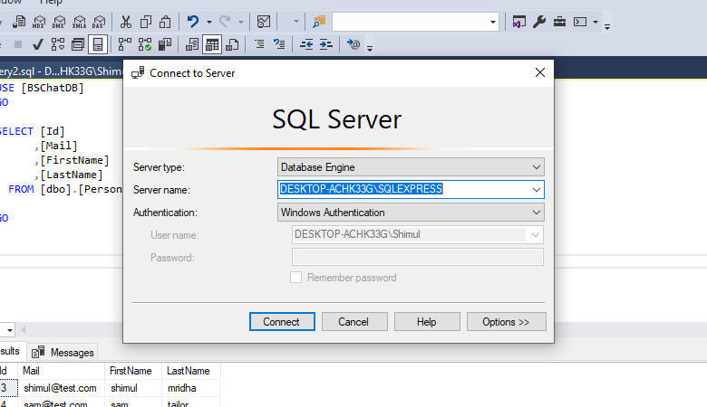
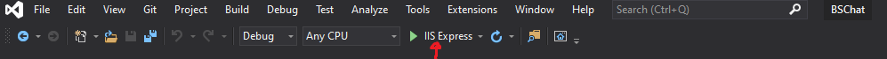

# BSChat (Server-side)

This project was generated with .NET 5 .

## Install git
Download and install [git](https://git-scm.com/downloads). We need git to work with the repository.

## Database Setup

###### DB setup
* Download and install MS Sql server on your system by visiting [here](https://www.microsoft.com/en-us/sql-server/sql-server-downloads) (Ignore if you have already installed). 
* Download SQL server management studio also, if you don't have already installed [SSMS](https://docs.microsoft.com/en-us/sql/ssms/download-sql-server-management-studio-ssms?view=sql-server-ver15).

###### Connect to database engine
After the installation open Microsoft sql server management studio and connect it to your database engine. For further instructions visit [Microsoft SSMS doc here](https://docs.microsoft.com/en-us/sql/relational-databases/lesson-1-connecting-to-the-database-engine?view=sql-server-ver15).

###### Importing database
* Click on `New query` on the toolbar of Sql server management studio. This will open a new script window.
* Copy the script of `script.sql` file (inside BSChatBE directory) on the script window.
* Now click on `Execute query`. This will create the database for the project.

## Project setup

###### Dowload Tools
Download visual studio from here [Visual studio 2019](https://visualstudio.microsoft.com/downloads/) (If you don't already have). Install it on your system.

###### Edit DB Connection String
* Go to BSChatBE => BSChat directory, open appsettings.json file.
* Find this section- 
`"ConnectionStrings": {
    "BSChatDB": "Server=<Server_name>;Database=BSChatDB;Trusted_Connection=True;MultipleActiveResultSets=True;"
  },`
* Enter database server name in the place of `<server_name>`.
Ther server name can be found on sql server management studio.
 

### How to run the project with visual studio
* To start the project double click and run the `BSChat.sln` file with visual studio .
* Run the project with IISExpress by clicking on the IISExpress button on the toolbar of visual studio.
 
* Now check the [BSChatFE](https://github.com/EkhlasMridha/BSChatFE) repository for next instructions

# BSChatFE (Client side)

This project was generated with [Angular CLI](https://github.com/angular/angular-cli) version 10.0.1.

## Installing angular
* We need npm package manager to setup everything. Visit [Nodejs](https://nodejs.org/en/) , download and install nodejs which will install npm package manager with it.
* Now install angular cli by running `npm install -g @angular/cli` command on terminal or command prompt on your machine. Visit [Angular CLI](https://cli.angular.io/) for detail.

## Install git
Download and install [git](https://git-scm.com/downloads). We need git to work with the repository.

## Project setup
###### Download tools
I prefer Visual studio code, but we can use any dev friendly text editor. 
* Download and install [Visual studio code](https://visualstudio.microsoft.com/downloads/)

###### Cloning the project on local machine
* Open command prompt or terminal on a directory.
* Run command `git clone https://github.com/EkhlasMridha/BSChatFE.git` on the terminal to clone the project on that directory.

###### Installing packages
* Open the BSChatFE project with VS code.
* Click on terminal on the top toolbar
* A terminal will open on the bottom side of VS code. Run command `npm install` on terminal to install the packages. (This may take some time).

## Run the project on Development server

*After the package has been installed run `npm start` or `ng serve` on the terminal to run the project on a dev server. Navigate to [http://localhost:4200/](http://localhost:4200/) on your browser.
* It needs to run both BSChatBE and BSChatFE project at the same time to make the project functional.

## Build

Run `ng build` to build the project. The build artifacts will be stored in the `dist/` directory. Use the `--prod` flag for a production build.

## Further help

To get more help on the Angular CLI use `ng help` or go check out the [Angular CLI README](https://github.com/angular/angular-cli/blob/master/README.md).
